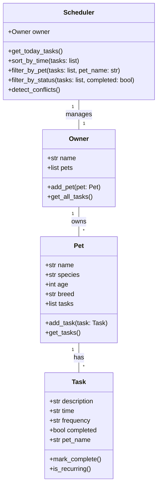

# 🐾 PawPal+: Smart Pet Care Management System

## 📖 Overview

PawPal+ is an intelligent pet care management application that helps pet owners maintain their furry friends' health and happiness by tracking daily routines, scheduling tasks, and automating recurring activities.

### What PawPal+ Does
- **Track Pet Profiles**: Store information about multiple pets (name, species, age, breed)
- **Schedule Daily Tasks**: Manage feedings, walks, medications, playtime, and vet appointments
- **Organize Priorities**: Automatically sort tasks by time and highlight urgent activities
- **Detect Conflicts**: Warn about overlapping schedules or duplicate tasks
- **Automate Recurrence**: Daily and weekly tasks automatically reschedule after completion

---

## 🎯 Core User Actions

The system supports three primary user actions:

1. **Add a Pet**: Owner creates a new pet profile with basic details
2. **Schedule a Task**: Owner adds a task (with time, frequency, and details) to a pet's schedule
3. **View Today's Schedule**: Owner sees all tasks organized by time, with conflict warnings

---

## 🏗️ System Architecture

### Class Diagram (Mermaid.js UML)



### Class Responsibilities

- **Owner**: Manages multiple pets and provides access to their collective task lists
- **Pet**: Stores pet details and maintains a list of assigned tasks
- **Task**: Represents a single activity with time, frequency, and completion status
- **Scheduler**: The "brain" that retrieves, organizes, sorts, filters, and analyzes tasks across all pets

---

## 🚀 Features

### ✅ Core Features
- **Pet Management**: Add, edit, and manage multiple pets
- **Task Scheduling**: Create tasks with specific times and frequencies
- **Sorting**: Tasks automatically sorted by time (earliest to latest)
- **Filtering**: View tasks by pet or completion status
- **Task Completion**: Mark tasks complete with automatic recurrence handling

### 🧠 Smart Features
- **Recurring Tasks**: Automatically generate next occurrence for daily/weekly tasks
- **Conflict Detection**: Identify overlapping task times and alert users
- **Task Status Tracking**: Distinguish between completed and pending tasks
- **Comprehensive Task Listing**: See all tasks organized by pet and time

---

## 📋 Testing PawPal+

The project includes an automated test suite to verify core functionality:

```bash
pip install -r requirements.txt
python -m pytest tests/test_pawpal.py -v
```

**Test Coverage:**
- ✅ Task completion and status changes
- ✅ Task addition and pet task count
- ✅ Sorting tasks chronologically
- ✅ Filtering tasks by pet name and status
- ✅ Detecting task time conflicts
- ✅ Recurring task generation (daily/weekly)

**Confidence Level:** ⭐⭐⭐⭐ (4/5 stars)

---

## 🛠️ Usage

### Running the CLI Demo
```bash
python main.py
```

### Running the Streamlit App
```bash
streamlit run app.py
```

### Running Tests
```bash
python -m pytest -v
```

---

## 📁 Project Structure

```
ai110-week2/
├── pawpal_system.py       # Core logic: Owner, Pet, Task, Scheduler classes
├── pawpal_main.py         # CLI demo script for testing backend logic
├── pawpal_app.py          # Streamlit UI for user interactions
├── requirements.txt       # Python dependencies
├── PAWPAL_README.md       # This file
├── PAWPAL_reflection.md   # Project reflection and design decisions
└── tests/
    └── test_pawpal.py     # Automated test suite
```

---

## 💭 Design Decisions

### Key Tradeoffs

1. **Time Format (String vs DateTime)**
   - Decision: Used simple "HH:MM" string format for clarity
   - Tradeoff: String comparison is simpler but less flexible for complex time math

2. **Conflict Detection Strategy**
   - Decision: Check for exact time matches
   - Tradeoff: Simple and fast, but doesn't detect overlapping durations

3. **Recurring Task Approach**
   - Decision: Create new Task instance when marked complete
   - Tradeoff: Clean separation of concerns, but requires session management in Streamlit

---

## 🤝 Collaboration with AI

This project was developed using a "AI-assisted" approach:
- Architecture brainstorming and UML design with Copilot
- Class skeleton generation from UML diagrams
- Algorithm implementation (sorting, filtering, conflict detection)
- Test generation and debugging support
- Documentation and code review suggestions

---

**Built with AI assistance**
