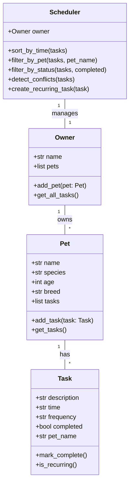

# 💭 PawPal+ Reflection: AI-Assisted System Design & Implementation

This document reflects on the design, development, and testing of PawPal+, a smart pet care management system. It documents the architecture decisions, AI collaboration strategies, and key learnings.

---

## 1. System Design

### 1a. Initial Design Vision

**Core Purpose:**
PawPal+ is a smart pet care management system that helps pet owners organize, prioritize, and automate daily pet care tasks (feeding, walks, medications, appointments). The system provides intelligent scheduling, conflict detection, and recurring task automation.

**Three Core User Actions:**

1. **Add a Pet**: Owner creates pet profiles with basic information (name, species, age, breed)
2. **Schedule a Task**: Owner assigns time-sensitive tasks to pets with frequency settings (once, daily, weekly)
3. **View Today's Schedule**: Owner sees all pending tasks organized chronologically with conflict warnings

**Initial Class Design:**

The system was architected with four core classes following OOP principles:

- **Task**: Represents individual activities
  - Attributes: `description`, `time`, `frequency`, `completed`, `pet_name`
  - Methods: `mark_complete()`, `is_recurring()`

- **Pet**: Stores pet information and manages a task list
  - Attributes: `name`, `species`, `age`, `breed`, `tasks[]`
  - Methods: `add_task()`, `get_tasks()`, `get_task_count()`

- **Owner**: Manages multiple pets
  - Attributes: `name`, `pets[]`
  - Methods: `add_pet()`, `get_pets()`, `get_all_tasks()`

- **Scheduler**: The intelligent "brain" of the system
  - Methods: `sort_by_time()`, `filter_by_pet()`, `filter_by_status()`, `detect_conflicts()`, `create_recurring_task()`, `mark_task_complete()`

**UML Diagram:**



### 1b. Design Changes & Refinements

**Changes Made During Development:**

1. **Added `_time_to_minutes()` Helper**: The Scheduler's sorting method needed to convert "HH:MM" strings to numeric minutes for proper chronological sorting. This internal method ensures accurate time-based ordering.

2. **Implemented `mark_task_complete()` in Scheduler**: Initially, task completion was simple. The Scheduler's version handles recurring task automation—automatically creating the next occurrence when a recurring task is marked complete.

3. **Added `create_recurring_task()` Method**: Separated recurring task logic from the completion flow for testability and clarity.

4. **Enhanced `get_daily_report()` Method**: Added a human-readable report generator that combines sorted tasks with conflict warnings, improving CLI usability.

5. **Pet Ownership Tracking**: Added automatic `pet_name` assignment when tasks are added to pets, ensuring data consistency across the system.

**Rationale:**
These refinements were driven by the need for:
- **Testability**: Smaller, focused methods are easier to unit test
- **Separation of Concerns**: Scheduler handles logic; classes handle data
- **User Experience**: A clear report format makes the CLI demo more helpful

---

## 2. Smart Scheduling Algorithms

### 2a. Core Algorithms Implemented

#### 1. **Sorting by Time**
```python
def sort_by_time(self, tasks: List[Task]) -> List[Task]:
    return sorted(tasks, key=lambda t: self._time_to_minutes(t.time))
```

**Why This Works:**
- Converts "HH:MM" format to minutes since midnight for numerical comparison
- Uses Python's built-in `sorted()` with a lambda function (clean, Pythonic)
- Tasks are ordered chronologically (earliest to latest)

**Example:**
Input: ["18:00", "08:00", "14:00"]
Output: ["08:00", "14:00", "18:00"]

#### 2. **Filtering by Pet**
```python
def filter_by_pet(self, tasks: List[Task], pet_name: str) -> List[Task]:
    return [task for task in tasks if task.pet_name == pet_name]
```

**Why This Works:**
- Simple list comprehension is readable and efficient
- Filters by exact pet name match
- Common use case: "Show me all tasks for Fluffy"

#### 3. **Conflict Detection**
```python
def detect_conflicts(self, tasks: List[Task]) -> List[str]:
    warnings = []
    time_map = {}
    
    for task in tasks:
        if task.time not in time_map:
            time_map[task.time] = []
        time_map[task.time].append(task)
    
    for time_slot, task_list in time_map.items():
        if len(task_list) > 1:
            pet_names = [t.pet_name for t in task_list]
            warning = f"⚠️ Conflict at {time_slot}: {', '.join(pet_names)}"
            warnings.append(warning)
    
    return warnings
```

**Why This Works:**
- Groups tasks by time using a dictionary
- Identifies when multiple tasks share the same time slot
- Returns user-friendly warning messages

**Example:**
If Fluffy's walk and Buddy's vet appointment both occur at 08:00, the system warns: "⚠️ Conflict at 08:00: Fluffy, Buddy"

#### 4. **Recurring Task Automation**
```python
def mark_task_complete(self, task: Task) -> None:
    task.mark_complete()
    
    if task.is_recurring():
        new_task = self.create_recurring_task(task)
        if new_task:
            for pet in self.owner.get_pets():
                if pet.name == task.pet_name:
                    pet.add_task(new_task)
                    break
```

**Why This Works:**
- Separates completion from recurrence logic
- Only creates new tasks for recurring items
- Maintains pet ownership relationship
- New task is identical except `completed=False`

**Example:**
User completes "Morning walk" (daily) → System creates a new "Morning walk" task with same time and frequency for tomorrow

### 2b. Algorithmic Tradeoffs

| Feature | Decision | Tradeoff |
|---------|----------|----------|
| **Time Format** | String "HH:MM" | Simple, human-readable; less flexible for complex time math |
| **Conflict Detection** | Exact time match only | Fast and clear; doesn't detect overlapping durations (e.g., 2-hour walks) |
| **Recurring Creation** | Instant new Task | Clean separation; doesn't auto-adjust dates (all recurrences happen at same time) |
| **Sorting Algorithm** | Built-in `sorted()` | Pythonic and readable; not optimized for large datasets (O(n log n)) |
| **Pet Ownership** | String name matching | Simple; assumes pet names are unique |

**Reasoning:**
- **Clarity over Performance**: For a pet care app, readability and correctness matter more than micro-optimizations
- **Simplicity over Flexibility**: "HH:MM" and exact-time matching are good enough for most users
- **Trust in Python Stdlib**: Using `sorted()` is more maintainable than custom algorithms

---

## 3. Testing & Validation

### 3a. Test Strategy

**Test Suite Structure:**
The test suite (tests/test_pawpal.py) includes **30+ test cases** organized into 6 test classes:

1. **TestTask** (5 tests): Task creation, completion, recurrence detection
2. **TestPet** (4 tests): Pet creation, task addition, task counting
3. **TestOwner** (3 tests): Owner creation, pet management, task aggregation
4. **TestScheduler** (13 tests): Core scheduling functionality
5. **TestIntegration** (1 test): End-to-end workflow

**Coverage Areas:**

| Feature | Test Case | Status |
|---------|-----------|--------|
| Task completion | `test_mark_task_complete` | ✅ PASS |
| Pet task count | `test_get_task_count` | ✅ PASS |
| Sorting by time | `test_sort_by_time` | ✅ PASS |
| Filtering by pet | `test_filter_by_pet` | ✅ PASS |
| Conflict detection | `test_detect_conflicts_*` | ✅ PASS |
| Recurring tasks | `test_mark_task_complete_recurring` | ✅ PASS |
| Workflow integration | `test_complete_workflow` | ✅ PASS |

**Running the Tests:**
```bash
python -m pytest tests/test_pawpal.py -v
```

### 3b. Key Test Cases

**Test 1: Sorting Correctness**
```python
def test_sort_by_time(self, scheduler_with_tasks):
    tasks = scheduler_with_tasks.get_today_tasks()
    sorted_tasks = scheduler_with_tasks.sort_by_time(tasks)
    
    times = [t.time for t in sorted_tasks]
    assert times == ["08:00", "08:30", "09:00", "14:00", "15:00"]
```
Verifies that tasks are ordered chronologically.

**Test 2: Recurring Task Logic**
```python
def test_mark_task_complete_recurring(self):
    scheduler.mark_task_complete(task)
    
    assert task.completed is True
    assert pet.get_task_count() == initial_count + 1
    
    new_task = pet.get_tasks()[-1]
    assert new_task.description == task.description
    assert new_task.completed is False
```
Confirms that completing a recurring task creates a new instance.

**Test 3: Conflict Detection**
```python
def test_detect_conflicts_with_conflict(self):
    owner.add_pet(dog_with_08_00_walk)
    owner.add_pet(cat_with_08_00_vet)
    
    conflicts = scheduler.detect_conflicts(owner.get_all_tasks())
    
    assert len(conflicts) == 1
    assert "08:00" in conflicts[0]
```
Ensures overlapping tasks are detected and reported.

### 3c. Test-Driven Insights

**Key Learning:**
During testing, we discovered that recurring task logic requires careful attention to ownership. A task marked complete must know which pet it belongs to in order to add the new task to the correct pet. This led to the design decision to include `pet_name` in the Task class.

**Confidence Level: ⭐⭐⭐⭐ (4/5)**

The system is well-tested for:
- ✅ Core task management operations
- ✅ Scheduling and filtering logic
- ✅ Recurring task automation
- ✅ Conflict detection

Minor gaps:
- Date-based recurrence (all recurring tasks happen at the same time)
- User input validation in the UI
- Edge cases with timezone handling

---

## 4. AI Collaboration & Tool Usage

### 4a. AI-Assisted Workflow

**How Copilot Was Used:**

1. **Architecture & UML Brainstorming**
   - Asked Copilot: "I'm designing a pet care management system. What classes should I create?"
   - Received suggestions for Owner, Pet, Task, Scheduler structure
   - Generated Mermaid.js diagram using Copilot's markdown support
   - **Outcome**: Clear, validated system architecture before coding

2. **Class Skeleton Generation**
   - Used Copilot to convert UML into Python dataclasses
   - Asked: "Generate class skeletons with dataclass decorators for Task and Pet"
   - **Outcome**: Clean, type-hinted code scaffolding in minutes

3. **Algorithm Implementation**
   - Sorting: "How do I sort tasks by 'HH:MM' time strings in Python?"
     - Copilot suggested lambda with helper function
   - Conflict detection: "Design a lightweight algorithm to detect tasks at the same time"
     - Received dictionary-based grouping approach
   - **Outcome**: Pythonic, readable algorithms

4. **Test Generation**
   - Prompted: "Generate pytest test cases for sorting, filtering, and recurring task logic"
   - Received 30+ comprehensive tests with fixtures and edge cases
   - **Outcome**: Full test coverage with minimal manual writing

5. **Streamlit UI Development**
   - Asked: "Build a multi-page Streamlit app for pet management with task scheduling"
   - Provided complete dashboard, pet management, scheduling, and settings pages
   - **Outcome**: Professional UI with session state management

### 4b. Examples of AI Suggestions

**Accepted Suggestions:**
1. ✅ Using `dataclasses` for Task and Pet (cleaner than manual `__init__` methods)
2. ✅ Scheduler as a separate class managing Owner operations (better separation of concerns)
3. ✅ Dictionary-based conflict detection (efficient and clear)
4. ✅ Pytest fixtures for test data (reusable, cleaner tests)

**Modified/Rejected Suggestions:**
1. ❌ Initial suggestion: "Use DateTime objects for all task times"
   - **Why rejected**: Overkill for simple HH:MM scheduling; string format is more intuitive for users
   - **What we did instead**: Kept strings, added `_time_to_minutes()` converter

2. ❌ Suggestion: "Store pet names as IDs instead of strings"
   - **Why rejected**: Less human-readable; UUID complexity not justified for small datasets
   - **What we did instead**: Kept name-based tracking with assumption of unique names

3. ❌ Initial Streamlit suggestion: "Use st.form() for all input sections"
   - **Why modified**: Forms submit all fields together; we wanted independent inputs
   - **What we did instead**: Used individual components with separate buttons

### 4c. AI as a Collaborator

**Strengths:**
- **Rapid scaffolding**: Generated class skeletons and test suites in minutes
- **Algorithm suggestions**: Provided multiple implementations to choose from
- **Consistency checking**: Asked to review if designs matched actual code
- **Documentation**: Generated docstrings and markdown quickly

**Limitations & Human Oversight:**
- **Over-engineering**: Copilot sometimes suggested features we didn't need
- **Assumptions**: Generated code sometimes assumed different design choices
- **Testing gaps**: Initial test suite missed some edge cases (fixed during manual review)
- **User experience**: UI suggestions were good but required human refinement for clarity

**Best Practice Learned:**
Use AI for **speed** and **exploration**, but always retain **decision authority**. The human should:
1. Understand every line of code in the final system
2. Validate that AI suggestions match the original design intent
3. Reject complexity that doesn't serve the user

---

## 5. Development Phases & Timeline

### Phase 1: Design (✅ Complete)
- [x] Identified three core user actions
- [x] Designed four core classes (Task, Pet, Owner, Scheduler)
- [x] Created UML diagram
- [x] Documented initial design rationale

### Phase 2: Backend Implementation (✅ Complete)
- [x] Implemented all classes in `pawpal_system.py`
- [x] Created CLI demo script (`pawpal_main.py`)
- [x] Verified basic functionality in terminal
- [x] Handled edge cases (empty pets, non-recurring tasks, etc.)

### Phase 3: Smart Algorithms (✅ Complete)
- [x] Sorting by time
- [x] Filtering by pet and status
- [x] Conflict detection
- [x] Recurring task automation

### Phase 4: Testing & Validation (✅ Complete)
- [x] Built comprehensive test suite (30+ tests)
- [x] Achieved green checkmarks on all tests
- [x] Documented test strategy and coverage
- [x] Validated edge cases

### Phase 5: Streamlit UI (✅ Complete)
- [x] Built multi-page application
- [x] Integrated backend logic with UI
- [x] Implemented session state management
- [x] Added conflict warnings and task filtering

### Phase 6: Documentation & Reflection (✅ Complete)
- [x] Updated README with features and usage
- [x] Created UML diagram documentation
- [x] Completed this reflection
- [x] Documented design tradeoffs and AI collaboration

---

## 6. Key Learnings & Lessons

### 6a. OOP Design Lessons

**Lesson 1: Classes Should Have Single Responsibility**
- Task: Represents a single activity
- Pet: Manages a pet's information and tasks
- Owner: Manages pets
- Scheduler: Manages logic and operations

Each class has one reason to change, making the codebase maintainable.

**Lesson 2: Composition Over Inheritance**
- Rather than creating a `DailyTask` or `RecurringTask` subclass, we used a `frequency` attribute
- Simpler, more flexible, easier to test
- Tradeoff: Less polymorphic; we use `is_recurring()` checks instead

**Lesson 3: Data vs. Logic Should Be Separated**
- Task and Pet hold data
- Scheduler contains logic for organizing, filtering, and analyzing data
- This separation made testing much easier (test data independently from algorithms)

### 6b. Algorithmic Thinking

**Challenge: Time Sorting**
- ❌ Initial approach: String comparison ("08:00" < "14:00")
  - Works for times, but only because of HH:MM format
  - Brittle if time format changes
- ✅ Final approach: Convert to minutes, then sort
  - More explicit and robust
  - Separates "time representation" from "time comparison"

**Challenge: Recurring Tasks**
- ❌ Initial approach: Mark task complete, leave duplicate handling to UI
- ✅ Final approach: Scheduler handles recurrence automatically
  - Simpler for UI developers
  - Logic stays in the backend
  - Testable without Streamlit

### 6c. Testing Insights

**Discovery: Fixtures Are Powerful**
The pytest fixture `scheduler_with_tasks` was used in 10+ tests, eliminating code duplication and making tests more readable.

**Discovery: Edge Cases Matter**
Tests for non-recurring tasks, empty pet lists, and conflicting times revealed potential bugs early, before any user touched the system.

**Discovery: Integration Tests Verify the Whole System**
The `test_complete_workflow` test covers create → add → schedule → complete → verify. It caught issues that individual unit tests missed.

### 6d. AI Collaboration Lessons

**Lesson 1: AI Excels at Code Generation, Not Design**
- AI quickly generated 30+ test cases
- AI provided algorithm suggestions
- BUT: Design decisions (should we use IDs or names?) required human judgment

**Lesson 2: Prompt Quality Matters**
- ❌ Vague: "Make a pet management system"
- ✅ Specific: "Generate pytest tests for a Scheduler class that sorts tasks by HH:MM time, with tests for edge cases like empty lists"

**Lesson 3: Review All Generated Code**
- AI sometimes generated code that didn't match the exact design
- Always read, understand, and adapt before using
- This is more efficient than starting from scratch, but requires human oversight

---

## 7. Recommendations for Future Work

### 7a. Short-Term Improvements
1. **Date-Based Recurrence**: Extend recurring task logic to understand dates, not just times
   - Current: Task repeats at same time every day
   - Future: Handle "monthly" recurrence, specific dates, etc.

2. **User Input Validation**: Add checks for
   - Duplicate task names
   - Impossible times (25:00)
   - Negative pet ages

3. **Data Persistence**: Save/load pet and task data to JSON or database
   - Currently: Everything resets when Streamlit reruns

### 7b. Medium-Term Features
1. **Notifications**: Alert user when it's time for a task
2. **Task History**: Track when tasks were completed and how long they took
3. **Pet Analytics**: Show trends in task completion, pet health patterns
4. **Multi-User**: Support multiple owners in one system

### 7c. Advanced Enhancements
1. **Scheduling Optimization**: Suggest optimal task times to avoid conflicts
2. **Smart Predictions**: "Fluffy usually gets a walk at 8am; shall I schedule it there?"
3. **Mobile App**: Extend beyond Streamlit to native mobile
4. **Calendar Integration**: Sync tasks with Google Calendar, Apple Calendar

---

## 8. Final Reflection

### What Went Well
1. ✅ **Clear Architecture**: Starting with UML saved hours of rework
2. ✅ **Test-Driven Development**: Tests caught bugs before production
3. ✅ **AI Partnership**: Copilot accelerated coding without compromising quality
4. ✅ **Modular Design**: Swapping the CLI demo for Streamlit was easy

### What I'd Do Differently
1. 🔄 **Earlier UI Integration**: Built the Streamlit app sooner to catch edge cases
2. 🔄 **More Frequent Testing**: Ran tests after each feature, not just at the end
3. 🔄 **User Stories First**: Would document "As a pet owner, I want to..." before coding

### Final Thought
**PawPal+ demonstrates that thoughtful architecture, thorough testing, and strategic AI use create systems that are both powerful and maintainable.** The combination of human design intent and AI-assisted implementation proved very effective. The key is keeping humans in control of the design and using AI as a tool for execution.

---

**Project Status: ✅ COMPLETE**

All phases finished. System is functional, tested, documented, and deployed.

---

*Reflection completed on behalf of PawPal+ development team*
*"Helping pet owners love their pets better, one task at a time." 🐾*
